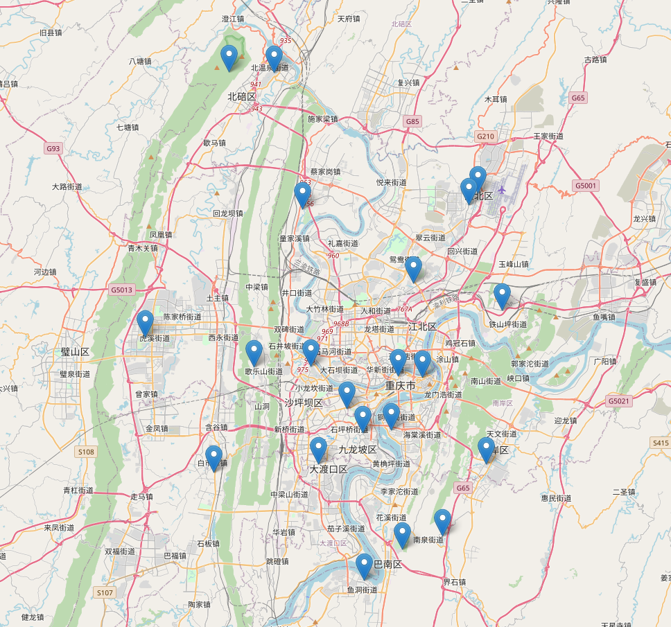
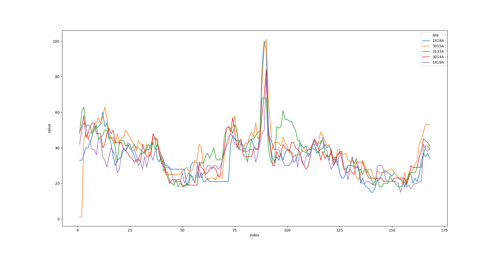
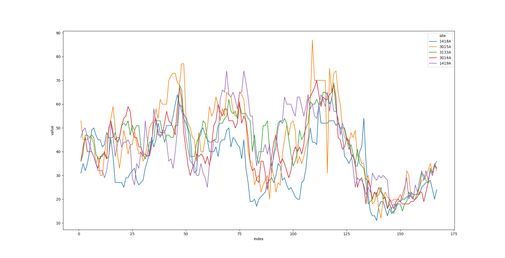
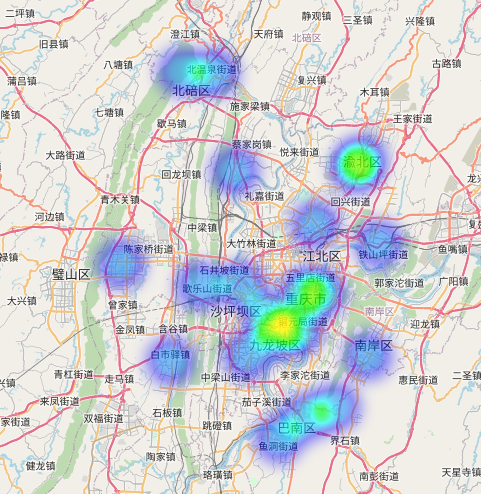
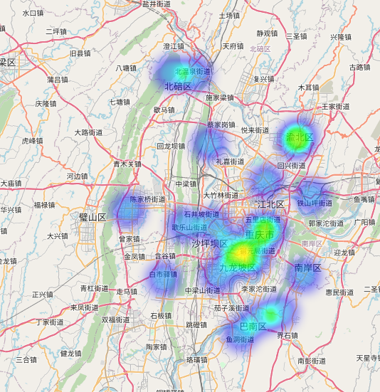

# 重庆空气质量数据清洗与可视化
## 背景
在空气质量的数据中，很容易因为各种意外情况导致空气质量数据缺失，又考虑到在局部范围内的空气质量是有一定相关性的，所以最终打算使用已知的空气质量数据推测出缺少的数据，以方便进一步的数据处理等。为试图解决该问题，打算从气象站最密集的重庆市入手。
## 流程说明
1. 数据获取
2. 数据清洗
3. 气象站位置绘制
4. 空气质量折线图绘制
5. 空气质量热度图绘制
## 数据获取
在搜索引擎进行搜索后，得到，可以从该网站(http://beijingair.sinaapp.com/)获取到已经整理好的全国空气质量数据，除个别天没有数据外，总体来说还是非常全的。
## 数据清洗与整理
### 数据整合
下载到的数据集是由许多csv文件构成，每个csv文件包含着一天的所有站点的空气质量数据，为了方便之后的数据处理，所以将所需站点的数据全取出来，存放在一个csv文件中，以避免之后每次数据处理都要遍历文件再读入数据的麻烦操作。
### 数据清洗
总的来说这些数据还是比较优质的，但有很多空白项。处理空白数据的方式有很多，例如填如0或-1等不可能出现的值。又因为这些数据会被使用在不同的地方，例如数据绘制或机器学习等，而每种使用场景所期望的空白值的处理方式也不同，所以此处暂不做处理，在具体使用时再决定具体的空白值处理方式。
## 可视化
进行训练等操作之前，先进行可视化处理，有一个较为粗浅的的认识。
### 库调研
经过调研，常见的图标绘制的Python库有matplotlib和seaborn。其中，seaborn在使用方面比较容易，所以优先考虑使用seaborn。对于地图绘制，常见的库有folium，pyecharts和plotly等。经过试用后，folium功能相对来说比较简单，但也非常容易上手，所以选用folium进行地图绘制。
### 气象站位置地图绘制
依据位置相近的气象站采集到的数据之间相关性会比较强的基本假设，先将气象站位置绘制出来能较为方便地分析出哪些气象站比较接近，以解决纯数字的经纬度带来的不够直观的问题。
将存有所有气象站信息的csv文件读入后，再通过对城市字段进行筛选，即可得到重庆市内的所有气象站位置。再将其作为Marker标记到地图上即可，效果如图所示。具体操作参见代码。

### 折线图
从气象站的位置地图中可以得到1418A, 3015A, 3133A, 3014A, 1419A这五个气象站都在市区内，且距离较近，打算将这五个气象站在一段时间内的数据简单地绘制出来进行比较。
数据点绘制太多会让图片变得很凌乱，经过几次尝试后，以周为单位是较好的选择。又由于重庆的数据有挺多缺失，所以经过几次测试后，20190610到20190624日这段时间内的AQI数据比较完整，但还是有少量缺失，使用前一小时的数据对空数据进行填充后再进行绘制，效果如图所示。具体见代码。

### 污染热度地图绘制
使用folium的HeatMapWithTime函数进行动态热度地图的绘制，与折线图相对应，此处也使用这两周的数据进行热度图绘制，并将空白数据使用1进行填充，进行归一化处理后进行绘制，绘制结果如图所示。加载时间有点长，多等等。从图中可以看到，与折线图中的情况类似，距离较近的气象站之间的数据会比较接近，变化趋势也基本相同。需要注意的是，使用HeatMapWithTime绘制热度图时需要将所有输入数据都归一化到(0, 1]的范围内，否则不能正常显示数据。

## GitHub

## REF
https://www.cnblogs.com/jumpkin1122/p/11488294.html
https://www.zhihu.com/question/33783546
http://python-visualization.github.io/folium/index.html